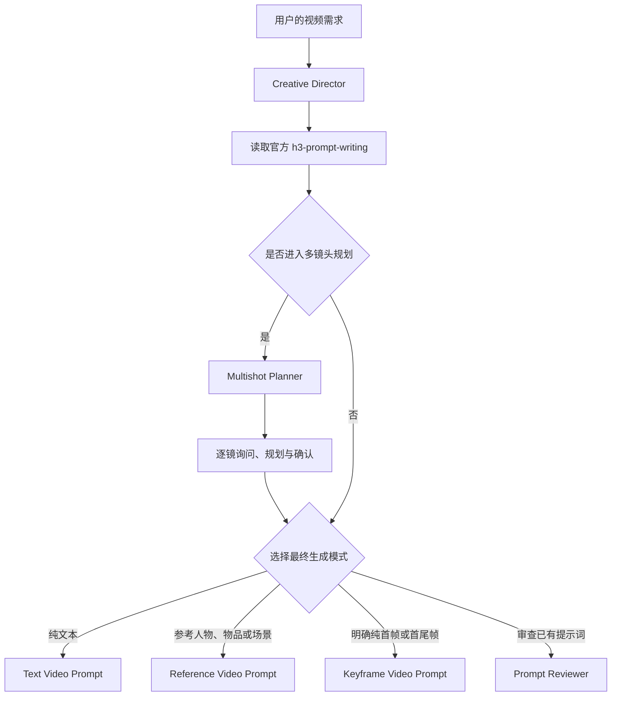

# MiniMax H3 OpenCode Skills

一套面向 OpenCode 的 MiniMax H3 视频提示词 Skill 系统。它把官方提示词规范、创意导演、模式路由、多镜头规划、最终提示词生成和提示词审查组合成一条完整工作流。

## 安装

把下面这个 GitHub 链接发给你的 AI，让它阅读仓库中的 `AGENTS.md` 并自动完成安装：

```text
https://github.com/unknowlei/minimax-h3-opencode-skills
```

可以直接对 AI 说：

```text
请安装这个仓库里的全部 OpenCode Skill，并按仓库中的 AGENTS.md 执行：
https://github.com/unknowlei/minimax-h3-opencode-skills
```

安装完成后，新建一个 OpenCode 会话，然后说：

```text
使用 minimax-h3-creative-director 帮我制作一个 MiniMax H3 视频提示词。
```

## Skill 组成

| Skill | 职责 |
| --- | --- |
| `h3-prompt-writing` | MiniMax 官方提示词结构规范，由安装 AI 从官方仓库获取 |
| `minimax-h3-creative-director` | 所有 MiniMax H3 请求的总入口，负责提问、模式判断和路由 |
| `minimax-h3-multishot-planner` | 对多镜头视频逐镜询问、规划、确认并输出镜头计划 |
| `minimax-h3-text-video-prompt` | 生成纯文字 T2VA 提示词 |
| `minimax-h3-reference-video-prompt` | 处理人物、物品、场景、风格、动作、音色等参考一致性需求 |
| `minimax-h3-keyframe-video-prompt` | 处理明确的纯首帧、首尾帧和尾帧边界控制需求 |
| `minimax-h3-prompt-reviewer` | 检查、修复和重写已有 H3 提示词 |

## 工作流程



## 核心规则

- 总导演是默认且最高优先级入口。
- 普通图片默认作为人物、物品、场景或风格参考，路由到参考一致性模式。
- 只有用户明确声明图片是纯首帧、尾帧或首尾帧，并且不承担任何参考一致性职责时，才进入关键帧模式。
- 用户明确要求多镜头时，必须先调用多镜头规划器。
- 视频时长达到10秒且用户没有说明单镜头或多镜头时，先询问是否使用多镜头。
- 多镜头规划必须逐镜执行；所有镜头确认前，不得进入最终提示词生成。
- 严格的是非题可以有2个选项，其他选择题必须提供至少5个有实际差异的选项。
- OpenCode 没有“三个问题”的工作流上限；每个阶段按需要提问。

## 文档

- [系统架构](docs/architecture.md)
- [路由规则](docs/routing-guide.md)
- [多镜头流程](docs/multishot-workflow.md)
- [使用指南](docs/usage-guide.md)
- [使用示例](docs/examples.md)

## 验证

项目内置 PowerShell 校验脚本：

```powershell
pwsh -File .\tests\validate-skills.ps1
```
