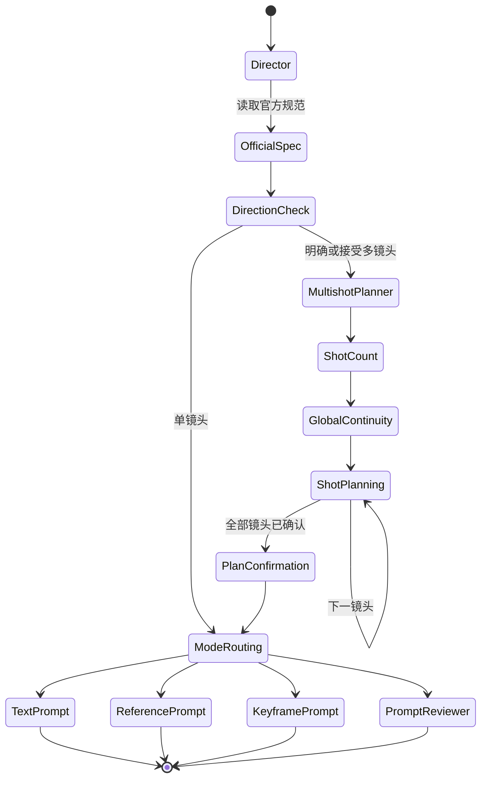

# 系统架构

## 分层设计

这套 Skill 使用四层结构，避免一个 Skill 同时承担提问、路由、规划和格式化任务。

### 1. 官方规范层

`h3-prompt-writing` 提供 MiniMax H3 官方提示词字段、基础模式和全参考模式规范。总导演与最终格式化 Skill 必须先读取它，不能凭记忆重建官方格式。

### 2. 导演与路由层

`minimax-h3-creative-director` 是所有 H3 请求的默认入口。它负责：

- 读取官方规范；
- 检查用户素材和目标；
- 在信息不足时使用结构化问题补全创意方向；
- 判断是否需要多镜头规划；
- 在文本、参考一致性、纯关键帧和审查模式之间路由。

### 3. 规划层

`minimax-h3-multishot-planner` 只负责镜头计划，不负责最终 H3 格式化。它以状态机方式询问镜头数量、全局节奏和每个镜头的内容，并要求逐镜确认。

### 4. 最终格式化层

- `minimax-h3-text-video-prompt`
- `minimax-h3-reference-video-prompt`
- `minimax-h3-keyframe-video-prompt`
- `minimax-h3-prompt-reviewer`

这些 Skill 接收已经确认的创意方向或镜头计划，并输出符合官方结构的提示词。

## 调用状态

## 状态隔离

加载 Skill 只代表读取指令，不代表 Skill 已经执行。尤其在多镜头流程中，加载规划器以后必须立即进入镜头数量询问；只有规划器返回 `multishot_plan_status: confirmed`，总导演才可以加载最终格式化 Skill。
